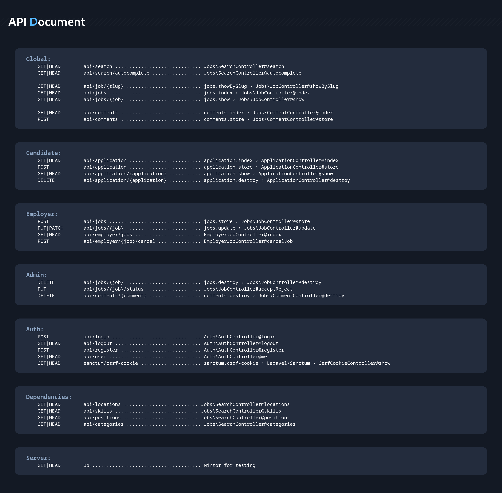

<p align="center">
  <a href="https://iti.gov.eg/" target="_blank" rel="noopener noreferrer">
    
  </a>
</p>

# Laravel API

This project was generated with [Laravel](https://laravel.com/docs) version 11.

## API Document

<div align="center">

</div>

## Development server

Run `php artisan serve` for a dev server. Navigate to `http://127.0.0.1:8000/`. The api will automatically reload if you change any of the source files.

## Build
```bash
composer install # Composer will install all dependency resources

php artisan migrate # Laravel will generate all tables
php artisan serve # Run service on port 8000
```
- **Don't Forget to add your DB informations in `.env`**
